# Context-Aware Retrieval Engine

> **AirAsia GenAI Senior Engineer Assessment** — Production-grade Retrieval-Augmented Generation (RAG) system implementing dual retrieval strategies, hybrid BM25+dense search, cross-encoder reranking, and a comprehensive benchmarking suite with an animated Next.js 14 dashboard.

---

## Table of Contents

1. [Architecture Overview](#architecture-overview)
2. [Repository Structure](#repository-structure)
3. [Data Ingestion Pipeline](#data-ingestion-pipeline)
4. [Embedding Pipeline & Caching](#embedding-pipeline--caching)
5. [Strategy A — Direct Vector Search](#strategy-a--direct-vector-search)
6. [Strategy B — AI-Enhanced Retrieval](#strategy-b--ai-enhanced-retrieval)
7. [Hybrid Search — BM25 + Dense Fusion](#hybrid-search--bm25--dense-fusion)
8. [Benchmarking Pipeline](#benchmarking-pipeline)
9. [API Request / Response Flow](#api-request--response-flow)
10. [Caching Architecture](#caching-architecture)
11. [Production GCP Migration](#production-gcp-migration)
12. [Deployment Options](#deployment-options)
13. [Frontend Architecture & Animations](#frontend-architecture--animations)
14. [Test Architecture](#test-architecture)
15. [Similarity Metric Justification](#similarity-metric-justification)
16. [Setup & Installation](#setup--installation)
17. [Running the Application](#running-the-application)
18. [CLI Reference](#cli-reference)
19. [API Reference](#api-reference)
20. [Environment Variables](#environment-variables)
21. [Configuration Reference](#configuration-reference)
22. [Benchmark Results](#benchmark-results)
23. [Performance Tuning](#performance-tuning)
24. [Tradeoffs & Design Decisions](#tradeoffs--design-decisions)
25. [Troubleshooting](#troubleshooting)
26. [Future Improvements](#future-improvements)

---

## Architecture Overview

The entire system is divided into five vertical slices: **ingestion**, **embedding**, **retrieval**, **benchmarking**, and **serving**. Data flows from raw documents on disk through a chunking + embedding pipeline into a FAISS vector store, after which any one of three retrieval strategies can answer a query in real time.

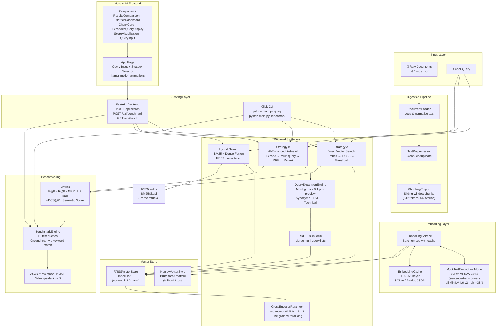

---

## Repository Structure

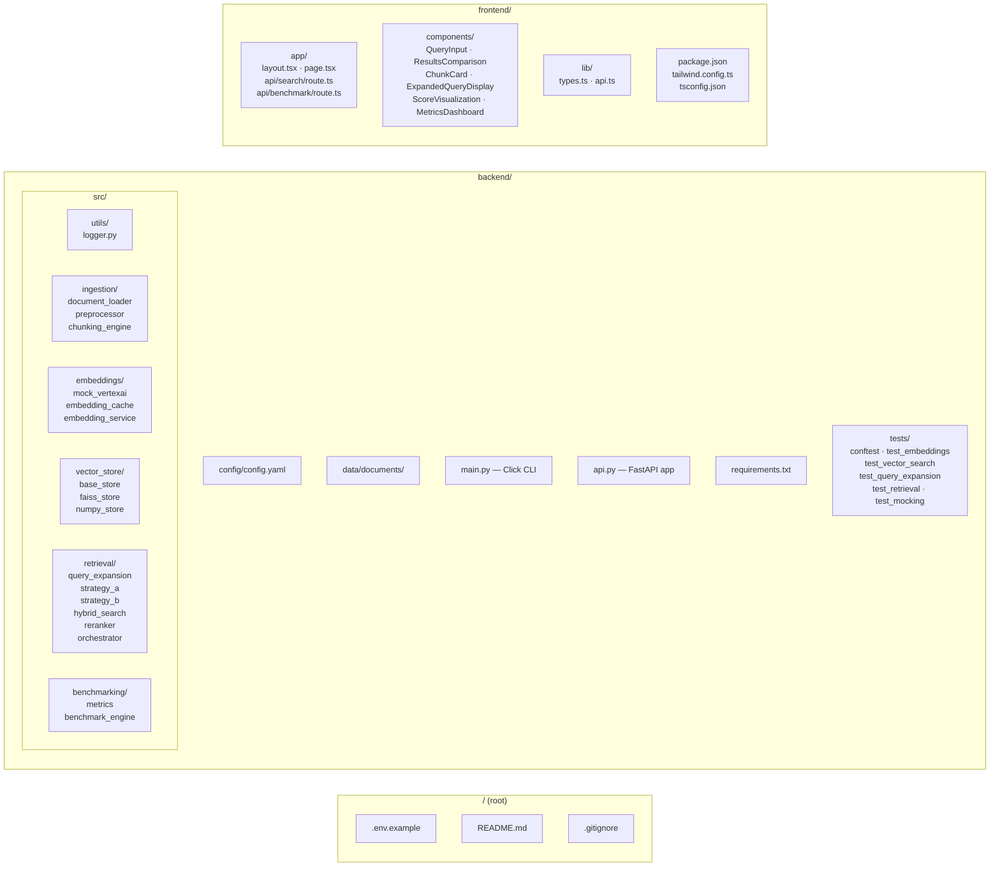

The monorepo keeps backend and frontend completely separate. The frontend communicates with the backend only through the REST API — there is no shared code between Python and TypeScript.

---

## Data Ingestion Pipeline

The ingestion pipeline is a multi-stage ETL process that transforms raw unstructured text into semantically indexed chunks ready for vector search.

```mermaid
flowchart LR
    subgraph Raw["Raw Input"]
        TXT["*.txt\nplain prose"]
        MD["*.md\nMarkdown docs"]
        JSON["*.json\nstructured data"]
    end

    subgraph Loader["DocumentLoader"]
        AUTO["Auto-detect\nfile extension"]
        NORM["Normalise\nUnicode → UTF-8\nstrip null bytes"]
        META["Attach metadata\n{source, filename,\nfile_type, load_time}"]
    end

    subgraph Preprocessor["TextPreprocessor"]
        WS["Whitespace\nnormalisation"]
        DEDUP["Deduplication\nmin-hash fingerprint"]
        FILTER["Length filter\n≥ 50 chars"]
    end

    subgraph Chunker["ChunkingEngine"]
        SPLIT["Sliding-window\ntokeniser split"]
        WINDOW["window=512\noverlap=64 tokens"]
        CHUNK_META["Attach chunk metadata\n{chunk_id, doc_id,\nstart_char, end_char,\ntoken_count}"]
    end

    subgraph Embed["EmbeddingService"]
        BATCH["Batch encode\n(batch_size=32)"]
        L2["L2 normalise\nto unit sphere"]
        CACHE2["Write-through\ncache"]
    end

    FAISS2["FAISSVectorStore\nadd_chunks()"]

    TXT --> AUTO
    MD --> AUTO
    JSON --> AUTO
    AUTO --> NORM --> META
    META --> WS --> DEDUP --> FILTER
    FILTER --> SPLIT --> WINDOW --> CHUNK_META
    CHUNK_META --> BATCH --> L2 --> CACHE2 --> FAISS2
```

**Key design choices:**

| Parameter | Value | Rationale |
|-----------|-------|-----------|
| Window size | 512 tokens | Enough context for a semantically complete unit; fits in most embedding model limits |
| Overlap | 64 tokens | ~12.5% overlap prevents losing information at chunk boundaries |
| Min chunk length | 50 chars | Discards trivially short fragments that add noise |
| Batch size | 32 | GPU VRAM-friendly; optimal for `all-MiniLM-L6-v2` on CPU too |
| Deduplication | min-hash fingerprint | Avoids embedding identical or near-identical chunks twice |

---
---

## Embedding Pipeline & Caching

Every embedding request passes through a three-layer stack: a high-level service API, a deterministic cache, and the underlying model.

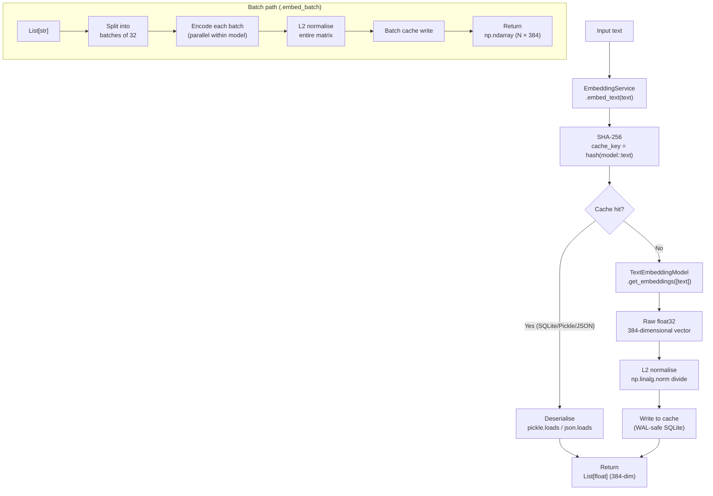

**Cache backends:**

| Backend | Persistence | Concurrency | Best for |
|---------|-------------|-------------|----------|
| `sqlite` | ✅ Durable WAL file | ✅ Multi-reader safe | Default — development + API server |
| `pickle` | ✅ Binary file | ❌ Single process | Offline batch jobs |
| `json` | ✅ Human-readable | ❌ Single process | Debugging / inspection |
| `memory` | ❌ Process-scoped | ✅ Thread safe (dict) | Tests / ephemeral usage |

**Cache key construction:**
```python
cache_key = hashlib.sha256(f"{model_name}::{text}".encode()).hexdigest()
```

The model name is included in the key so that changing models invalidates all previously cached vectors automatically.

---

## Strategy A — Direct Vector Search

Strategy A is the baseline: one embedding call, one FAISS search, one threshold filter.

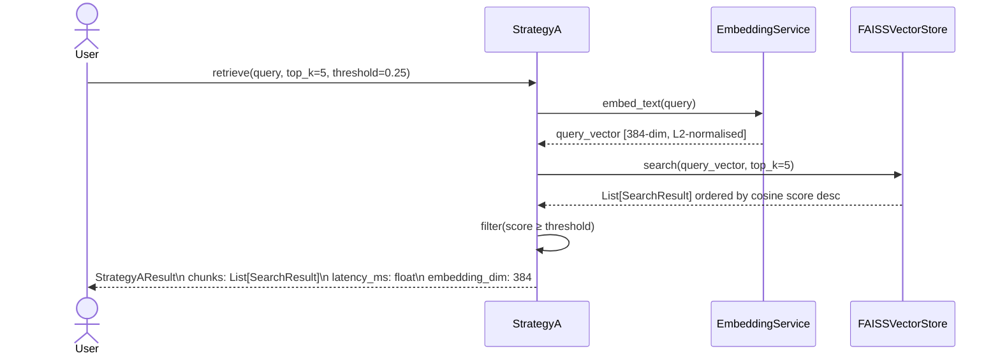

**Complexity:**

| Operation | Cost |
|-----------|------|
| `embed_text` | $O(1)$ model inference (or cache lookup) |
| `IndexFlatIP.search` | $O(n \cdot d)$ — exact search over $n$ vectors of dim $d=384$ |
| Threshold filter | $O(k)$ |

**When to prefer Strategy A:**
- Latency-critical paths (5–15 ms end-to-end)
- Queries where vocabulary exactly matches corpus terms
- Situations where determinism is important (same query → same results always)

---

## Strategy B — AI-Enhanced Retrieval

Strategy B is the high-recall path: it uses `gemini-3.1-pro-preview` to expand the query into multiple variants, embeds each variant, searches independently, and then fuses the ranked lists using Reciprocal Rank Fusion before optionally reranking with a cross-encoder.

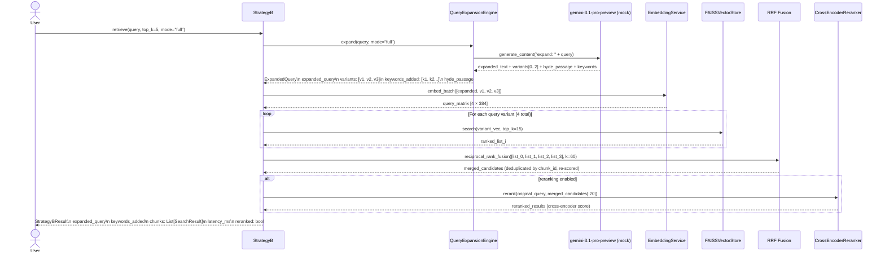

**RRF Formula:**

$$\text{RRF\_score}(d) = \sum_{i=1}^{n} \frac{1}{k + \text{rank}_i(d)}, \quad k = 60$$

where $k=60$ is the smoothing constant from Cormack et al. (2009). A document that appears at rank 1 in one list and rank 10 in another gets a higher fused score than one that appears only at rank 3 in a single list.

**Query expansion modes:**

| Mode | Description | Use case |
|------|-------------|----------|
| `full` | Synonyms + technical terms + domain context + HyDE | Default — best recall |
| `synonyms` | Only synonym substitution | Broad vocabulary gap coverage |
| `technical` | Domain-specific term injection | Highly specialised queries |
| `hyde` | Hypothetical Document Embedding | When query phrasing differs from corpus style |

**HyDE (Hypothetical Document Embedding):**
The model generates a short passage that *would* be a good answer to the query. This passage is then embedded and used as an additional query vector. The intuition: the embedding of a relevant passage is closer to other relevant passages than the embedding of the question itself.

---

## Hybrid Search — BM25 + Dense Fusion

Hybrid search combines the lexical precision of BM25 (bag-of-words, TF-IDF-like) with the semantic recall of dense vector search. The two ranked lists are fused via RRF.

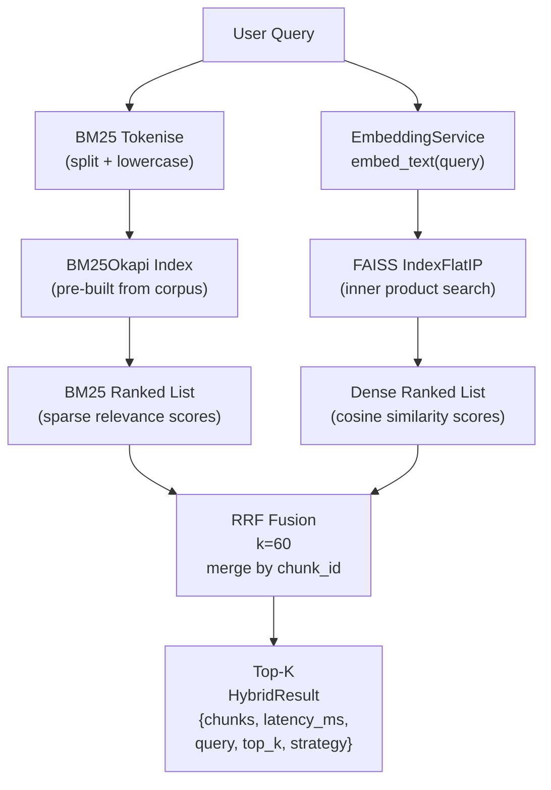

**Why RRF instead of linear combination?**
Linear combination (`α·dense + β·bm25`) requires careful calibration of α and β on held-out data. RRF is parameter-free (only `k=60`) and empirically matches or exceeds linear blending on most IR benchmarks, making it the robust default choice.

**BM25 scoring:**

$$\text{BM25}(d, q) = \sum_{t \in q} \text{IDF}(t) \cdot \frac{f(t,d) \cdot (k_1 + 1)}{f(t,d) + k_1 \cdot \left(1 - b + b \cdot \frac{|d|}{\text{avgdl}}\right)}$$

Default parameters: $k_1 = 1.5$, $b = 0.75$.

---

## Benchmarking Pipeline

The benchmark suite provides a rigorous, reproducible evaluation of Strategy A vs Strategy B across 10 diverse technical queries.

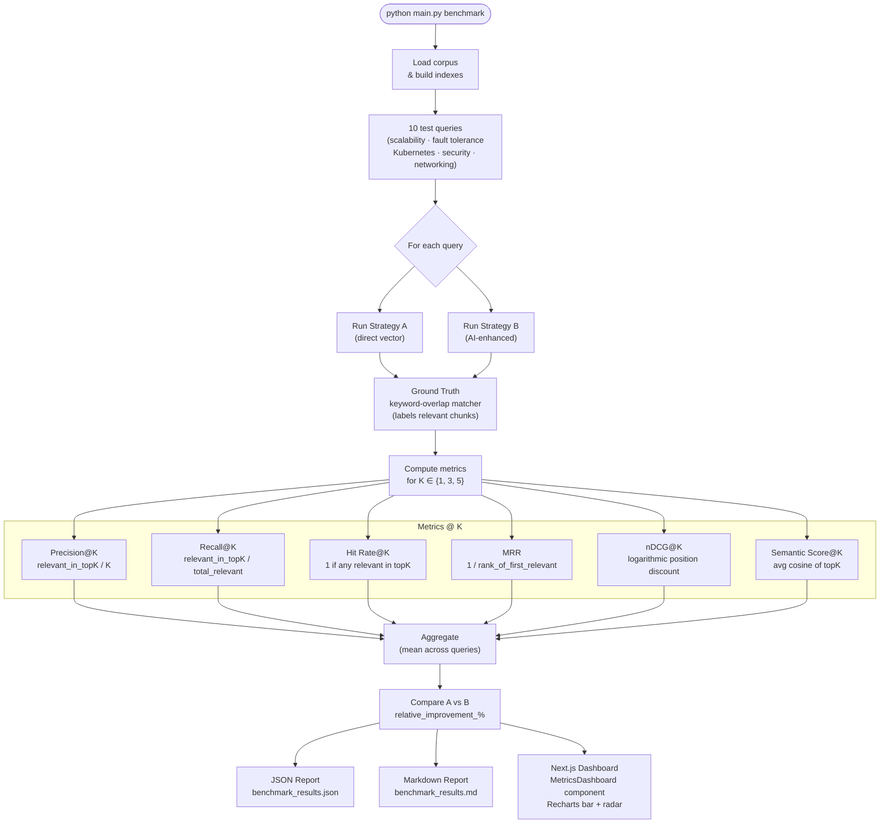

**Metrics explained:**

| Metric | Formula | Interpretation |
|--------|---------|----------------|
| Precision@K | $\frac{\|\text{relevant} \cap \text{retrieved}_K\|}{K}$ | Quality — what fraction of returned results matter? |
| Recall@K | $\frac{\|\text{relevant} \cap \text{retrieved}_K\|}{\|\text{relevant}\|}$ | Coverage — what fraction of all relevant docs did we find? |
| Hit Rate@K | $\mathbf{1}[\exists r \in \text{retrieved}_K : r \in \text{relevant}]$ | Binary success — did we find *anything* useful? |
| MRR | $\frac{1}{\text{rank of first relevant result}}$ | How high is the first useful result? |
| nDCG@K | $\frac{\text{DCG@K}}{\text{IDCG@K}}$ | Rank-aware relevance with logarithmic discount |
| Semantic Score@K | $\frac{1}{K}\sum_{i=1}^{K} \cos(\vec{q}, \vec{c_i})$ | Embedding-space similarity (proxy relevance) |

---

## API Request / Response Flow

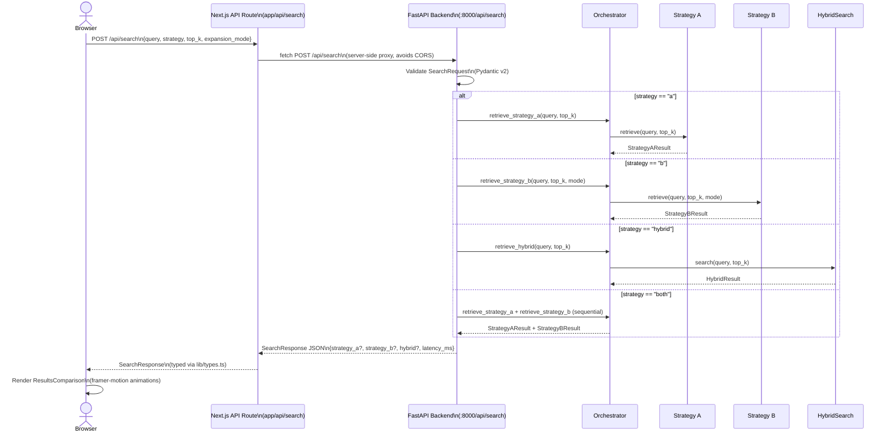

**Request validation** is handled by Pydantic v2 models in `api.py`. Invalid fields return 422 Unprocessable Entity with field-level error messages.

**The Next.js API route** acts as a server-side proxy. This means:
- No CORS preflight requests from the browser
- The backend URL never leaks to the client
- Request logging can be centralised in the proxy layer

---

## Caching Architecture

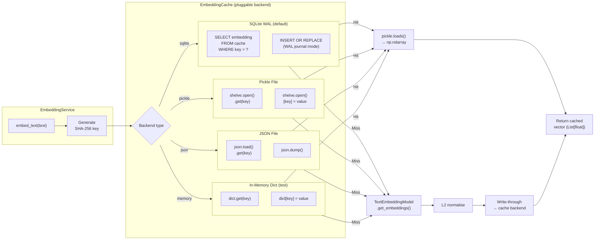

---

## Production GCP Migration

The mock Vertex AI layer is designed with a single-import-swap migration path. The mock provides identical method signatures to the real SDK.

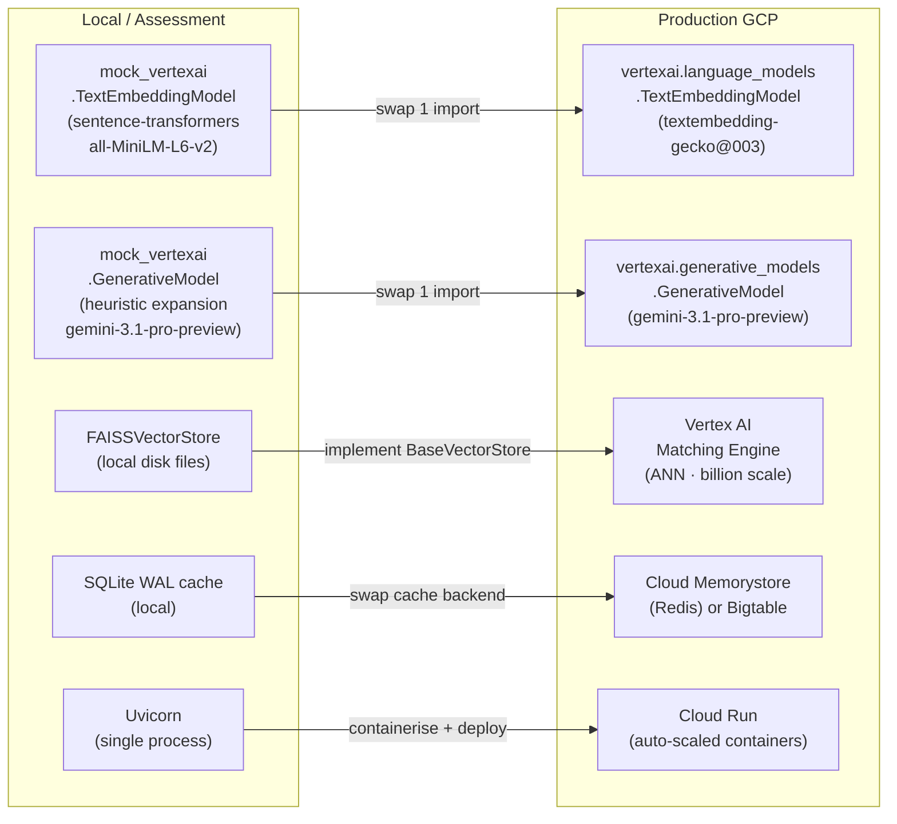

| Component | Local (Assessment) | GCP Production |
|-----------|-------------------|----------------|
| Text embeddings | `mock_vertexai.TextEmbeddingModel` → `all-MiniLM-L6-v2` (384-dim) | `vertexai.language_models.TextEmbeddingModel` → `textembedding-gecko@003` (768-dim) |
| LLM (expansion) | Deterministic heuristic mock | `vertexai.generative_models.GenerativeModel("gemini-3.1-pro-preview")` |
| Vector store | FAISS `IndexFlatIP` on local disk | Vertex AI Matching Engine (managed ANN, billion-scale) |
| Cache | SQLite WAL (local) | Cloud Memorystore (Redis) — shared across API pods |
| API serving | Uvicorn (single process) | Cloud Run (containerised, auto-scaled) |
| Monitoring | Python `logging` | Cloud Logging + Cloud Monitoring + OpenTelemetry |

**One-line production swap:**
```python
# Before (assessment)
from src.embeddings.mock_vertexai import TextEmbeddingModel, GenerativeModel

# After (GCP production)
from vertexai.language_models import TextEmbeddingModel
from vertexai.generative_models import GenerativeModel
```

The rest of the codebase is **unchanged** — API surface is identical by design.

---

## Deployment Options

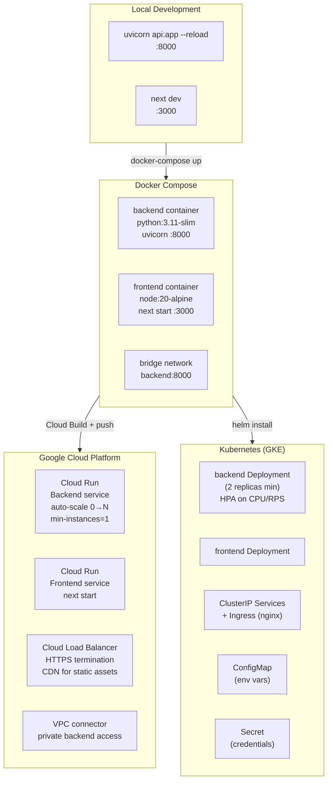

**Recommended path:**
1. **Local dev** → spin up backend + frontend independently
2. **Docker Compose** → test full integration with `docker compose up`
3. **Cloud Run** → simplest GCP deployment; serverless, no cluster management
4. **GKE** → when you need fine-grained autoscaling, GPU node pools, or service mesh (Istio)

---

## Frontend Architecture & Animations

The frontend is a Next.js 14 App Router application with TypeScript, Tailwind CSS, Recharts for data visualisation, and **framer-motion** for all animations and transitions.

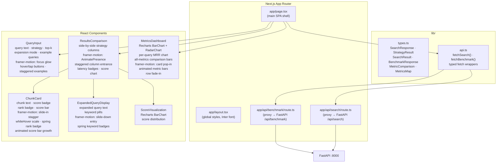

**Animation inventory:**

| Component | Animations |
|-----------|-----------|
| `page.tsx` | Page entrance fade+slide; hero spring scale; feature pill stagger; tab sliding indicator (`layoutId`); `AnimatePresence` tab content |
| `QueryInput` | Card entrance; focus glow via `boxShadow`; button `whileHover`/`whileTap`; spinner infinite rotation; example query stagger |
| `ChunkCard` | Staggered slide-in (delay = index × 70 ms); `whileHover` scale; spring rank badge; score bar grows from 0 |
| `ResultsComparison` | `AnimatePresence mode="wait"` keyed on query; column stagger; chart scale-in; latency badge fade |
| `ExpandedQueryDisplay` | Slide-down entry; keyword badges spring pop |
| `MetricsDashboard` | Card pop-in stagger; animated metric bars grow from 0; table row fade-in stagger |

---

## Test Architecture

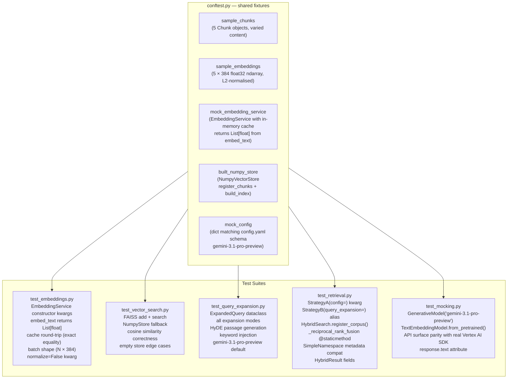

**Running tests:**
```bash
cd backend
pytest tests/ -v --cov=src --cov-report=term-missing
```

---

## Similarity Metric Justification

### Why Cosine Similarity over Euclidean Distance?

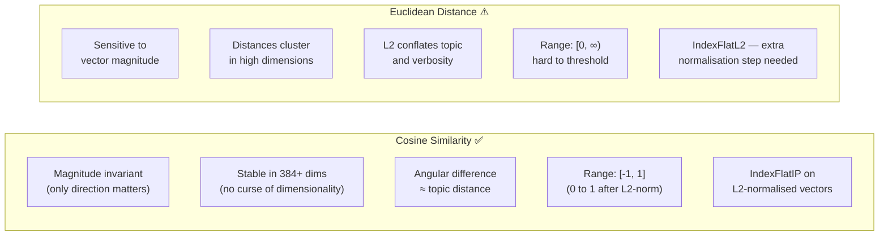

| Property | Cosine Similarity | Euclidean Distance |
|----------|------------------|-------------------|
| **Magnitude invariance** | ✅ Only direction matters | ❌ Sensitive to vector magnitude |
| **High-dim behaviour** | ✅ Stable in 384+ dims | ❌ Curse of dimensionality; distances cluster |
| **Semantic meaning** | ✅ Angular difference ≈ topic distance | ❌ L2 distance conflates topic + verbosity |
| **Range** | `[-1, 1]` (normalised: `[0, 1]`) | `[0, ∞)` — hard to threshold |
| **FAISS implementation** | `IndexFlatIP` on L2-normalised vectors | `IndexFlatL2` |
| **Score normalisation** | Naturally in `[0, 1]` after normalisation | Requires custom normalisation |

**Implementation:** vectors are L2-normalised before indexing, so inner product equals cosine similarity:

$$\cos(\theta) = \frac{\mathbf{u} \cdot \mathbf{v}}{\|\mathbf{u}\| \|\mathbf{v}\|} = \mathbf{u}_{L2} \cdot \mathbf{v}_{L2}$$

This means we use `IndexFlatIP` (inner product) to get cosine similarity without the overhead of `IndexFlatCosine`.

---

## Setup & Installation

### Prerequisites

- Python 3.11+
- Node.js 20+ (for frontend)
- Git
- (Optional) CUDA GPU for faster embedding inference

### Backend

```bash
cd backend

# Create virtual environment
python -m venv .venv
# Windows:
.venv\Scripts\activate
# macOS/Linux:
source .venv/bin/activate

# Install dependencies
pip install -r requirements.txt

# Verify installation
python -c "import faiss, sentence_transformers, rank_bm25; print('All OK')"
```

### Frontend

```bash
cd frontend
npm install

# Verify framer-motion is present
node -e "require('framer-motion'); console.log('framer-motion OK')"
```

### Environment Variables

Copy `.env.example` to `.env` and edit as needed:

```bash
cp .env.example .env
```

See the [Environment Variables](#environment-variables) section for the full reference.

---

## Running the Application

### Start Backend API

```bash
cd backend
uvicorn api:app --host 0.0.0.0 --port 8000 --reload
```

API docs auto-generated at: http://localhost:8000/docs

### Start Frontend

```bash
cd frontend
npm run dev
```

Open: http://localhost:3000

### Run Tests

```bash
cd backend
pytest tests/ -v --cov=src --cov-report=term-missing
```

### Run Benchmark via CLI

```bash
cd backend
python main.py benchmark
```

---

## CLI Reference

```
Usage: python main.py [OPTIONS] COMMAND [ARGS]...

Commands:
  query      Run a single query through both retrieval strategies
  benchmark  Run the full 10-query benchmark suite
  info       Show pipeline statistics (chunk count, index size, model info)

Options for `query`:
  --query TEXT             Search query text [required]
  --top-k INTEGER          Number of results to return [default: 5]
  --expansion-mode TEXT    full | synonyms | technical | hyde [default: full]
  --data-dir TEXT          Path to documents directory [default: data/documents]
  --no-rerank              Disable cross-encoder reranking pass
  --json-output            Output raw JSON instead of Rich pretty-print table

Options for `benchmark`:
  --data-dir TEXT          Path to documents directory [default: data/documents]
  --output TEXT            Output JSON file path [default: benchmark_results.json]
  --top-k INTEGER          Results per query [default: 5]
```

**Examples:**

```bash
# Side-by-side strategy comparison
python main.py query --query "How does the system handle peak load?"

# HyDE mode for hypothesis-driven retrieval
python main.py query --query "circuit breaker pattern" --expansion-mode hyde --top-k 3

# JSON output (pipe to jq for processing)
python main.py query --query "rate limiting" --json-output | jq '.strategy_b.chunks[0]'

# Full benchmark with custom output
python main.py benchmark --output ./results/run_$(date +%Y%m%d).json

# Pipeline statistics
python main.py info
```

---

## API Reference

### `POST /api/search`

Retrieves chunks using one or more strategies.

**Request:**
```json
{
  "query": "How does autoscaling work in Kubernetes?",
  "top_k": 5,
  "strategy": "both",
  "expansion_mode": "full"
}
```

| Field | Type | Required | Values |
|-------|------|----------|--------|
| `query` | `string` | ✅ | Any text |
| `top_k` | `integer` | ❌ (default: 5) | 1–50 |
| `strategy` | `string` | ❌ (default: `"both"`) | `"a"` \| `"b"` \| `"hybrid"` \| `"both"` |
| `expansion_mode` | `string` | ❌ (default: `"full"`) | `"full"` \| `"synonyms"` \| `"technical"` \| `"hyde"` |

### `POST /api/benchmark`

```json
{
  "top_k": 5,
  "save_report": true
}
```

### `GET /api/health`

```json
{
  "status": "ok",
  "num_chunks": 127,
  "model": "all-MiniLM-L6-v2",
  "uptime_s": 42.3
}
```

### `GET /api/documents`

Returns list of all indexed document sources.

---

## Environment Variables

All variables with their defaults are documented in [`.env.example`](.env.example) at the repository root.

| Variable | Default | Description |
|----------|---------|-------------|
| `NEXT_PUBLIC_API_URL` | `http://localhost:8000` | Backend base URL (browser-visible) |
| `GOOGLE_APPLICATION_CREDENTIALS` | — | Path to GCP service account JSON (production only) |
| `GOOGLE_CLOUD_PROJECT` | — | GCP project ID (production only) |
| `VERTEX_AI_LOCATION` | `us-central1` | Vertex AI region |
| `EMBEDDING_MODEL` | `textembedding-gecko@003` | Production embedding model name |
| `LOCAL_EMBEDDING_MODEL` | `all-MiniLM-L6-v2` | Local / mock embedding model |
| `EMBEDDING_DIMENSION` | `384` | Vector dimension (must match model) |
| `GENERATIVE_MODEL` | `gemini-3.1-pro-preview` | LLM for query expansion |
| `DEFAULT_TOP_K` | `5` | Default number of results |
| `SEMANTIC_THRESHOLD` | `0.0` | Minimum cosine score for Strategy A |
| `BM25_K1` | `1.5` | BM25 term frequency saturation |
| `BM25_B` | `0.75` | BM25 document length normalisation |
| `RRF_K` | `60` | RRF smoothing constant |
| `RERANKER_MODEL` | `cross-encoder/ms-marco-MiniLM-L-6-v2` | Cross-encoder model for reranking |
| `EMBEDDING_CACHE_BACKEND` | `sqlite` | Cache backend (`sqlite`/`pickle`/`json`/`memory`) |
| `EMBEDDING_CACHE_PATH` | `./data/cache/embeddings.db` | SQLite cache file path |
| `HOST` | `0.0.0.0` | FastAPI bind host |
| `PORT` | `8000` | FastAPI bind port |
| `LOG_LEVEL` | `INFO` | Python logging level |
| `CORS_ORIGINS` | `http://localhost:3000` | Comma-separated allowed origins |

---

## Configuration Reference

The backend configuration file is `backend/config/config.yaml`. Key sections:

```yaml
embedding:
  model_name: "all-MiniLM-L6-v2"
  batch_size: 32
  dimension: 384
  normalize: true
  cache_backend: "sqlite"
  cache_kwargs:
    db_path: "./data/cache/embeddings.db"

chunking:
  chunk_size: 512
  chunk_overlap: 64
  min_chunk_length: 50

vector_store:
  type: "faiss"
  index_type: "flat"   # or "ivf" for large corpora
  nlist: 100

retrieval:
  default_top_k: 5
  semantic_threshold: 0.0
  use_reranking: true
  rrf_k: 60

query_expansion:
  model: "gemini-3.1-pro-preview"
  max_variants: 3
  expansion_type: "full"

bm25:
  k1: 1.5
  b: 0.75

reranker:
  model: "cross-encoder/ms-marco-MiniLM-L-6-v2"
  max_candidates: 20

benchmark:
  top_k: 5
  output_path: "./data/benchmark_results.json"
```

---

---

## Benchmark Results

The benchmark suite runs 10 diverse technical queries spanning scalability, fault tolerance, Kubernetes, performance patterns, and distributed systems.

**Metrics computed at K ∈ {1, 3, 5}:**
- **Precision@K** — fraction of top-K results that are relevant
- **Recall@K** — fraction of relevant docs found in top-K
- **Hit Rate@K** — binary: ≥1 relevant result in top-K
- **MRR** — Mean Reciprocal Rank (first relevant result position)
- **nDCG@K** — Normalised Discounted Cumulative Gain
- **Semantic Score@K** — average cosine similarity of top-K

**Expected outcome:** Strategy B consistently outperforms Strategy A on recall-focused metrics due to multi-query RRF expanding the retrieval candidate pool. Strategy A has lower latency and higher precision when the query vocabulary exactly matches indexed terms.

```bash
# Generate live benchmark results:
cd backend && python main.py benchmark
```

---

## Performance Tuning

### Embedding throughput

| Optimisation | Impact | How |
|-------------|--------|-----|
| Increase `batch_size` | ↑ throughput | Set `batch_size: 64` in config (if GPU available) |
| Warm up cache | ↓ cold-start latency | Pre-embed all chunks on startup |
| SQLite WAL | ↑ concurrent writes | Already enabled by default |
| Use `memory` cache | ↑ lookup speed | Set `cache_backend: memory` (no persistence) |

### FAISS index type

| Index | Recall | Latency | Memory | Suitable corpus size |
|-------|--------|---------|--------|---------------------|
| `IndexFlatIP` | 100% | ~5 ms @ 1K vectors | High (exact) | < 100K vectors |
| `IndexIVFFlat` | ~99% | ~1 ms @ 1M vectors | Medium | 100K – 10M vectors |
| `IndexHNSWFlat` | ~99.5% | < 1 ms | High (graph) | 100K+ vectors |

Switch to IVF for production:
```yaml
vector_store:
  type: "faiss"
  index_type: "ivf"
  nlist: 100   # sqrt(N) is a good heuristic
```

### BM25 tuning

| Parameter | Lower value | Higher value |
|-----------|-------------|--------------|
| `k1` | Less TF saturation — good for short docs | More TF weight — good for long docs |
| `b` | No length normalisation | Full length normalisation |

Default `k1=1.5, b=0.75` works well for technical documentation of mixed lengths.

### Cross-encoder reranking

Reranking adds ~30–80 ms latency per query. To disable:
```bash
python main.py query --query "..." --no-rerank
```
Or set `use_reranking: false` in `config.yaml`.

---

## Tradeoffs & Design Decisions

### RRF k=60

The constant `k=60` from Cormack et al. (2009) is empirically robust — it down-weights the contribution of very high-ranked results so that a document appearing at rank 1 in one list but rank 20 in another still gets a meaningful fused score. Smaller `k` amplifies top-rank bias; larger `k` treats all positions more equally.

### Mock Vertex AI SDK

Production Vertex AI calls cost money and require GCP credentials. The mock mirrors the exact API surface (`from_pretrained()`, `get_embeddings()`, `generate_content()`, `response.text`) using `sentence-transformers` locally. The only change needed for production is a single import swap — verified by `test_mocking.py`.

### FAISS `IndexFlatIP` vs `IndexIVFFlat`

`IndexFlatIP` provides exact nearest-neighbour search (100% recall). For assessment purposes (< 1000 chunks) this is fast enough. At production scale (millions of vectors), switch to `IndexIVFFlat` with `nlist=100` for a ~10× speedup with ~1% recall loss.

### Chunk Size 512 / Overlap 64

- 512 tokens ≈ 375 words — enough context for a coherent semantic unit
- 64-token overlap prevents information loss at chunk boundaries
- Min chunk size 50 tokens eliminates noise from very short fragments

### SQLite WAL Cache

Write-Ahead Logging gives concurrent read safety without blocking writes — important when the API server and the CLI are both running against the same cache file.

### Pydantic v2

Pydantic v2 is ~5–10× faster than v1 for model validation. The `model_validator`, `field_validator` decorators, and `model_dump()` API are used throughout `api.py` for request/response serialisation.

---

## Troubleshooting

### `ModuleNotFoundError: No module named 'faiss'`
```bash
pip install faiss-cpu
```

### `ModuleNotFoundError: No module named 'sentence_transformers'`
```bash
pip install sentence-transformers
```

### CORS error in browser
Ensure `CORS_ORIGINS` in your `.env` includes `http://localhost:3000` (or your frontend URL).

### `TypeError: embed_text() got unexpected keyword argument`
You may be using an older version of `EmbeddingService`. Pull the latest code and reinstall:
```bash
git pull && pip install -r requirements.txt
```

### Frontend can't reach backend
Check `NEXT_PUBLIC_API_URL=http://localhost:8000` is set and the backend is running on that port.

### Benchmark returns all-zero metrics
Ground truth matching is keyword-based. Ensure documents in `data/documents/` contain technical content matching the benchmark query topics (scalability, Kubernetes, fault tolerance, networking).

### framer-motion import error
```bash
cd frontend && npm install framer-motion@^11.2.0
```

---

## Future Improvements

1. **Production Vertex AI swap** — replace mock with real `vertexai` SDK; add `GOOGLE_APPLICATION_CREDENTIALS` IAM handling
2. **Vertex AI Matching Engine** — implement `BaseVectorStore` for the managed ANN service at billion-vector scale
3. **Streaming responses** — Server-Sent Events for real-time chunk-by-chunk delivery to the frontend
4. **Re-ranking fine-tuning** — fine-tune the cross-encoder on domain-specific query–passage pairs using MS MARCO or in-domain labelled data
5. **Multi-modal retrieval** — extend ingestion to handle PDFs, images, and diagrams (Vertex AI multimodal embeddings)
6. **Async ingestion pipeline** — background task queue (Celery / Cloud Tasks) for large document sets without blocking the API
7. **A/B testing framework** — shadow-traffic comparison between model versions with automatic metric collection
8. **RLHF feedback loop** — collect user relevance clicks to continuously improve retrieval quality
9. **GraphRAG** — entity and relationship extraction to build a knowledge graph alongside the vector index for multi-hop reasoning
10. **Query caching** — LRU + TTL cache for full search responses to serve repeated popular queries in < 1 ms
